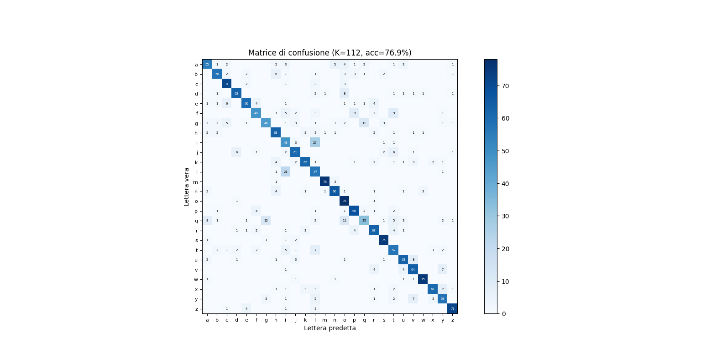
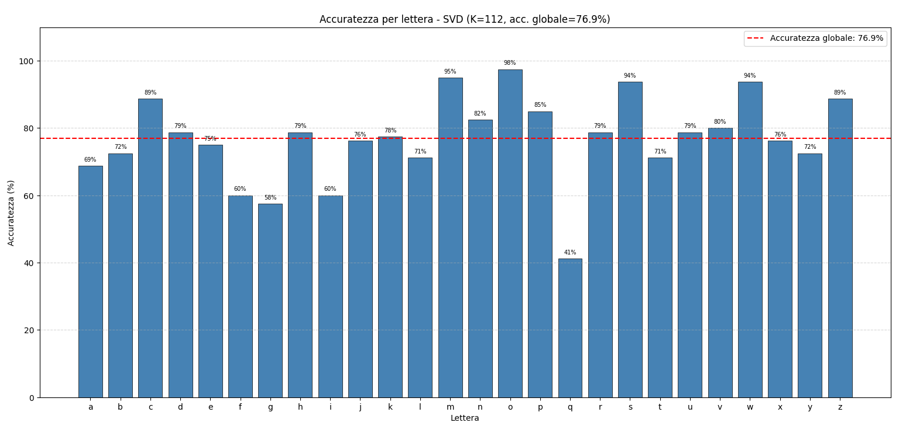
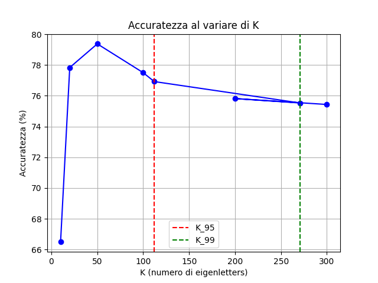

# EMNIST Letter Recognition via SVD

A from-scratch implementation of handwritten letter classification using **Singular Value Decomposition (SVD)** — no ML frameworks, only NumPy. Inspired by the classic *eigenfaces* technique, this project applies the same idea to letters ("eigenletters").

Built as a university project for a Numerical Computing course.

---

## How it works

The core idea is to use SVD as a dimensionality reduction tool, then classify images by finding the nearest neighbor in the compressed feature space.

### Pipeline

```
Raw images (784 pixels each)
        │
        ▼
  Subtract mean image  ──► "mean letter" removed
        │
        ▼
  Compute SVD of training matrix A (784 × N)
  A = U · Σ · Vᵀ
        │
        ▼
  Keep top-K left singular vectors (U_K)
  → these are the "eigenletters"
        │
        ▼
  Project train & test images into K-dimensional space
  P = U_Kᵀ · A
        │
        ▼
  Classify test image by minimum Euclidean distance
  to all training projections
```

### Why SVD?

Each 28×28 image lives in a 784-dimensional space. SVD finds the directions of maximum variance in the training data. The first K singular vectors (columns of U) capture the most information with the fewest dimensions. Projecting onto these vectors gives compact, discriminative representations of each letter.

The number K is chosen to retain **95% of the cumulative singular value energy**:

```
E(k) = Σᵢ₌₁ᵏ σᵢ² / Σᵢ σᵢ²  ≥ 0.95
```

---

## Dataset

**EMNIST Letters** — a subset of the EMNIST dataset containing 26 handwritten letter classes (a–z), each image 28×28 pixels in grayscale.

| Split    | Images   | Classes |
|----------|----------|---------|
| Training | 112,800  | 26      |
| Test     | 18,800   | 26      |

> This project uses a balanced subsample: **300 images/letter** for training, **80 images/letter** for testing.

**Download:** [https://biometrics.nist.gov/cs_links/EMNIST/gzip.zip](https://biometrics.nist.gov/cs_links/EMNIST/gzip.zip)

Required files (IDX binary format):
```
emnist-letters-train-images-idx3-ubyte
emnist-letters-train-labels-idx1-ubyte
emnist-letters-test-images-idx3-ubyte
emnist-letters-test-labels-idx1-ubyte
```

---

## Project Structure

```
emnist_svd/
├── emnist_svd.py                          # Main script
├── images/
│   ├── confusion_matrix.png               # Results visualizations
│   ├── accuracy_per_letter.png
│   └── accuracy_vs_k.png
├── emnist-letters-train-images-idx3-ubyte # Dataset files (not tracked by git)
├── emnist-letters-train-labels-idx1-ubyte
├── emnist-letters-test-images-idx3-ubyte
└── emnist-letters-test-labels-idx1-ubyte
```

---

## Setup & Usage

### 1. Clone the repository

```bash
git clone https://github.com/YOUR_USERNAME/emnist-svd.git
cd emnist-svd
```

### 2. Create a virtual environment

```bash
python -m venv .venv
# Windows
.venv\Scripts\activate
# Linux / macOS
source .venv/bin/activate
```

### 3. Install dependencies

```bash
pip install numpy matplotlib
```

### 4. Download and place the dataset

Download the EMNIST archive from the link above, extract it, and copy the 4 required files into the project root (same directory as `emnist_svd.py`).

### 5. Run

```bash
python emnist_svd.py
```

---

## Output

The script produces the following visualizations:

| Figure | Description |
|--------|-------------|
| 1 | Mean letter (average over all training images) |
| 2 | Cumulative singular value energy vs. K, with 95% and 99% thresholds |
| 3 | A randomly chosen test letter to classify |
| 4 | Distance profile from the test letter to all training projections |
| 5 | The best-matching training letter found |
| 6 | Full 26×26 confusion matrix |
| 8 | Per-letter accuracy bar chart |

Console output includes:
- Dataset dimensions
- SVD matrix shapes
- K values for 95% and 99% energy
- Single-image classification result (correct/wrong)
- Global accuracy on the full test set
- Per-letter accuracy breakdown

---

## Results

With the default settings (300 training images/letter, K = K₉₅ = 112):

- **Global accuracy: 76.9%** on the balanced test set (80 images/letter)

### Confusion Matrix



The diagonal is well-defined for most letters, meaning the classifier is generally reliable. The most notable confusions are:

- **`i` ↔ `l`** — visually very similar in many handwriting styles (27 `i`s misclassified as `l`)
- **`q` ↔ `a`, `g`** — `q` has the lowest per-letter accuracy (41%), frequently confused with similar round letters
- **`f` ↔ `t`** — both share a horizontal bar, causing misclassifications in both directions

### Per-letter Accuracy



| Best letters | Accuracy | Worst letters | Accuracy |
|---|---|---|---|
| `o` | 98% | `q` | 41% |
| `m` | 95% | `g` | 58% |
| `s`, `w` | 94% | `f`, `i` | 60% |
| `n` | 82% | `t`, `u` | 71% |

Letters with distinctive shapes (`o`, `m`, `s`, `w`) are classified almost perfectly. Letters that are visually ambiguous or that vary heavily across handwriting styles (`q`, `g`, `f`) are the hardest.

### Accuracy vs. K



Accuracy peaks around **K = 50** (~79.5%), then slightly decreases for larger K. This counter-intuitive behaviour is a known property of nearest-neighbour classifiers in high-dimensional spaces: adding more dimensions beyond what is needed introduces noise and makes distance metrics less discriminative. K₉₅ = 112 is a reasonable operating point (77%), but the optimal K for this specific task is lower.

---

## Key Concepts

### SVD decomposition

```
A = U · Σ · Vᵀ
```

- `A` — training matrix, shape `(784, N_train)`, each column is a mean-subtracted image
- `U` — left singular vectors, shape `(784, N_train)` — the "eigenletters"
- `Σ` — diagonal matrix of singular values (encoding variance)
- `Vᵀ` — right singular vectors

The economy (thin) SVD is used: only the `min(784, N_train)` singular values are computed.

### Projection

```python
UK = U[:, :K]          # (784, K) — top-K eigenletters
P_train = UK.T @ A     # (K, N_train) — compressed coordinates
p_test  = UK.T @ x     # (K,) — test image projection
```

### Classification

```python
distances = [np.linalg.norm(P_train[:, j] - p_test) for j in range(N_train)]
predicted_label = labels_train[np.argmin(distances)]
```

---

## Dependencies

| Package    | Version  | Purpose              |
|------------|----------|----------------------|
| numpy      | ≥ 1.24   | Linear algebra, SVD  |
| matplotlib | ≥ 3.7    | Plots and figures    |

Python ≥ 3.10 recommended.

---

## License

MIT
